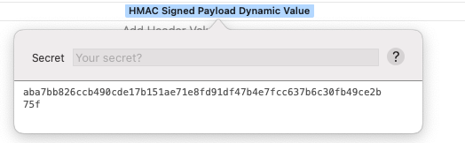

# HMAC Dynamic Value

## Paw Extension

In cryptography, an HMAC (sometimes expanded as either keyed-hash message authentication code or hash-based message authentication code) is a specific type of message authentication code (MAC) involving a cryptographic hash function and a secret cryptographic key. As with any MAC, it may be used to simultaneously verify both the data integrity and authenticity of a message.

HMAC can provide authentication using a shared secret instead of using digital signatures with asymmetric cryptography. It trades off the need for a complex public key infrastructure by delegating the key exchange to the communicating parties, who are responsible for establishing and using a trusted channel to agree on the key prior to communication.

### Installation

1. Pull down the repository.
2. Run `make install`.
3. Dasit

### Usage

In the [Paw Rest](https://paw.cloud) client:

1. Go to the **Headers** tab.
2. In the **Header, Name** column, enter the name for the signature check.
3. In the **Header Value** right, click and select **Extensions**; a new **Extensions** submenu will appear.
4. In the **Extensions** submenu, select **HMAC Signed Payload Dynamic Value**; the **Extension Configuration** popup will appear. 
5. In the **Extension Configuration** popup, enter your shared secret in the **Secret** field. This must match the secret of your target service; the dynamic value should now be calculated from the **Body** contents.
6.
